# Utiliza docker-compose para configurar las IP fijas a los dos contenedores 
**Configuramos las IPs fijas añadiendo la siguiente sección en los contenedores:**

***Contenedor DNS***:

  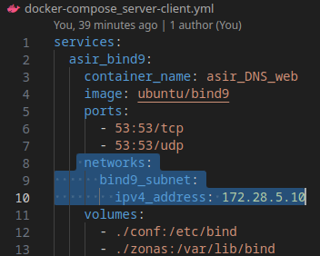

***Contenedor Apache***:

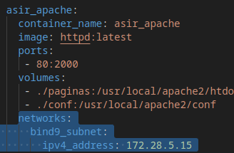

***Contenedor Cliente***:

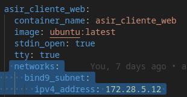 

# Añadimos dos zonas al DNS
1. www.fabulasmaravillosas.int
2. www.fabulasoscuras.com

***Primera Zona***:

 

***Comprobación con el "dig"***

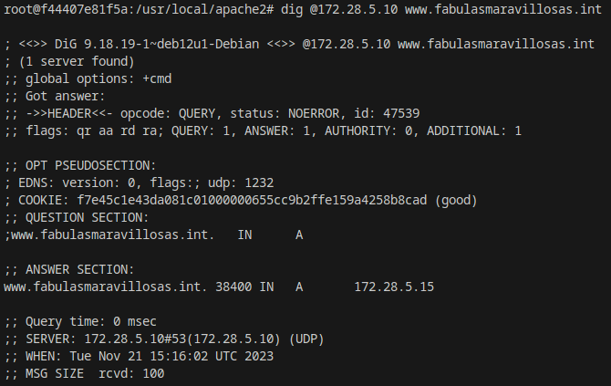 

***Segunda Zona***:

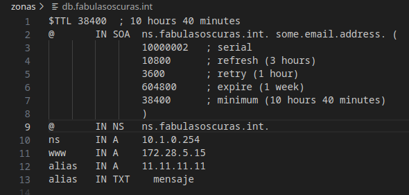 

  ***Comprobación con el "dig"***

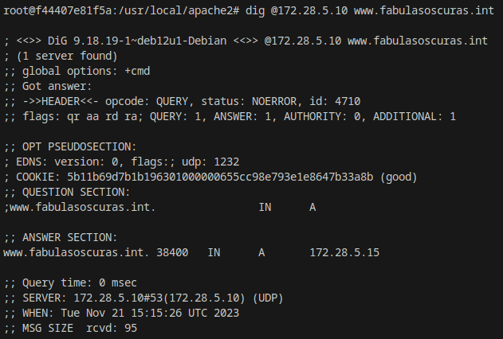 

# Utilización de la directiva "DirectoryIndex"

*Esta directiva se utiliza en servidores web para especificar el nombre de los archivos que se deben buscar y mostrar cuando un cliente solicita acceder a un directorio en lugar de un archivo específico.*

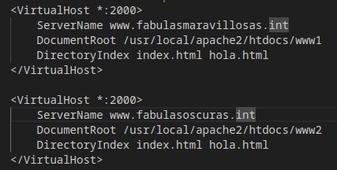 

*En este ejemplo, se le está diciendo al servidor web Apache que, al acceder a un directorio, primero busque un archivo llamado "index.html" y, si no lo encuentra, busque un archivo llamado "hola.html". Si ninguno de estos archivos está presente, el servidor podría mostrar una lista de archivos en el directorio o devolver un error, dependiendo de la configuración adicional.*

# Configuración dos virtual-host separados para cada dominio en el mismo puerto 

***Creamos dos carpetas con un index.html cada una, en este caso "www1" y "www2"***

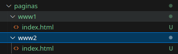

***En el archivo "httpd.conf" utilizamos la Directiva "VirtualHost" con la siguiente configuración:***

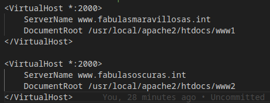

Para cada zona vinculamos una de las carpetas anteriormente creadas.
La ruta de "DocumentRoot" seria la siguiente más la carpeta que queremos vincular:

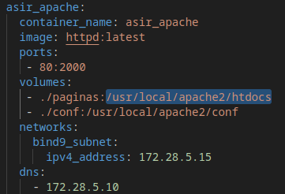

***Comprobamos desde el cliente si utilizando los nombres de dominio nos abre los index vinculados a cada uno***

*Utilizamos el siguiente comando:*

    lynx www.fabulasmaravillosas.int:2000
  En este caso se pone al final del comando ":2000" por que es el puerto que tengo mapeado, en caso de tener el 80 esto no haría falta

*Resultado*
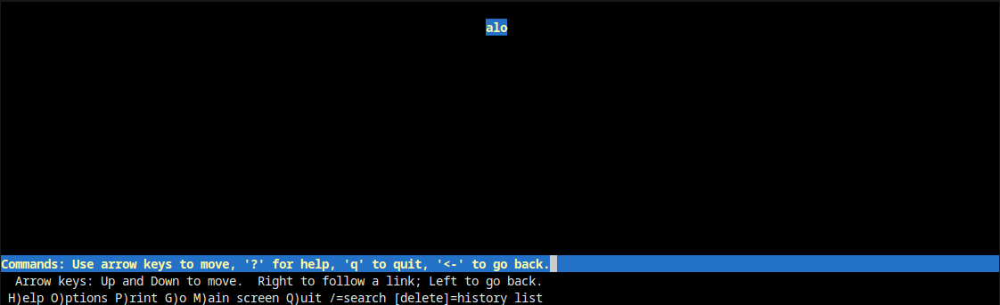

*Hacemos lo mismo para el siguiente dominio*

    lynx www.fabulasoscuras.int:2000
  En este caso se pone al final del comando ":2000" por que es el puerto que tengo mapeado, en caso de tener el 80 esto no haría falta

*Resultado*
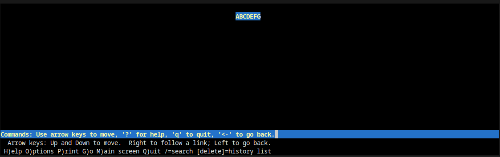

***Si todo funciona correctamente debería mostrarnos el contenido del index vinculado***