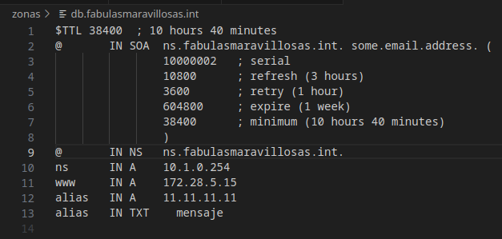

# Utiliza docker-compose para configurar las IP fijas a los dos contenedores 
**Configuramos las IPs fijas añadiendo la siguiente sección en los contenedores:**

***Contenedor DNS***:

    networks:
      bind9_subnet:
        ipv4_address: 172.28.5.10

***Contenedor Apache***:

    networks:
      bind9_subnet:
        ipv4_address: 172.28.5.15
***Contenedor Cliente***:

    networks:
      bind9_subnet:
        ipv4_address: 172.28.5.12  

# Añadimos dos zonas al DNS
1. www.fabulasmaravillosas.int
2. www.fabulasoscuras.com

***Primera Zona***:

 

***Comprobación con el "dig"***

 

***Segunda Zona***:

 

  ***Comprobación con el "dig"***

 

# Utilización de la directiva "DirectoryIndex"

*Esta directiva se utiliza en servidores web para especificar el nombre de los archivos que se deben buscar y mostrar cuando un cliente solicita acceder a un directorio en lugar de un archivo específico.*

 

*En este ejemplo, se le está diciendo al servidor web Apache que, al acceder a un directorio, primero busque un archivo llamado "index.html" y, si no lo encuentra, busque un archivo llamado "hola.html". Si ninguno de estos archivos está presente, el servidor podría mostrar una lista de archivos en el directorio o devolver un error, dependiendo de la configuración adicional.*